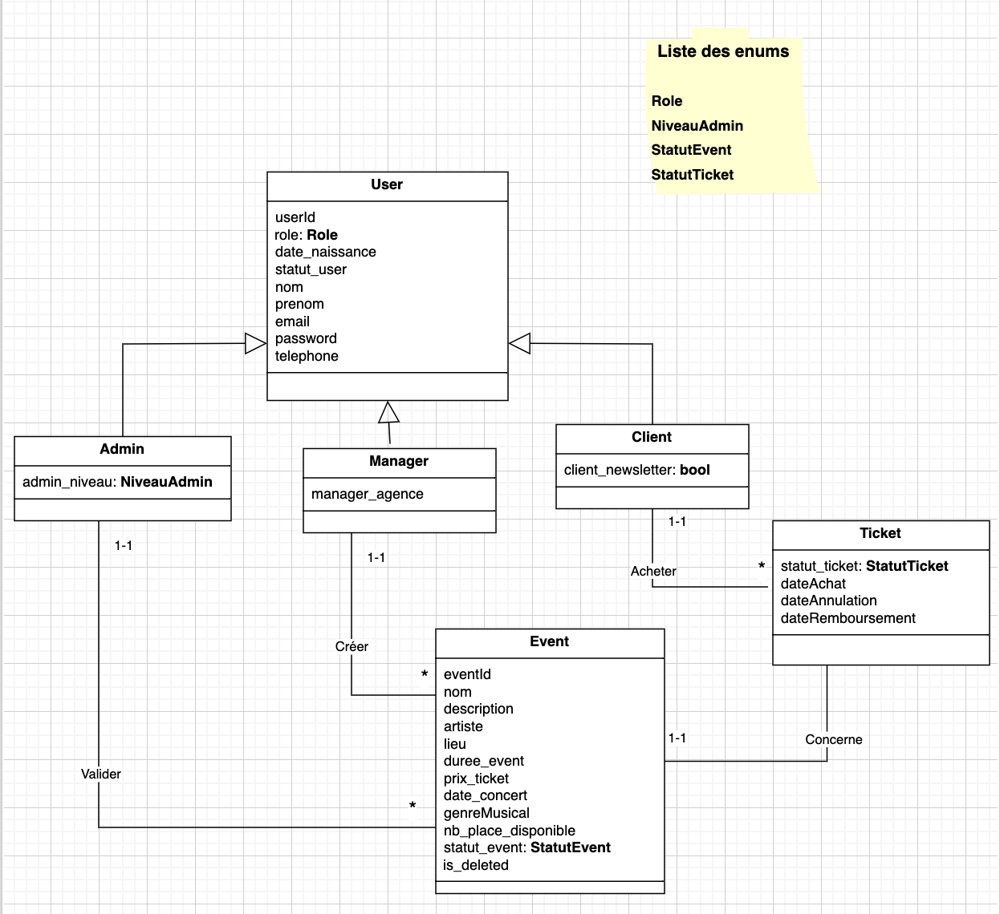

# Nom du Projet : E-Ticket

## Lancer le projet

###Prérequis
- Java & Maven installés
- Un serveur MySQL en cours d'exécution
- Eclipse (ou tout IDE supportant Maven)

###Une fois le projet cloné
1. Se placer sur la branche backend : *git checkout back* 

2. Builder le projet avec Maven Faire un clic droit sur le projet → Run As → Maven Build

3. Configurer la base de données: 
	- Créer une base de données vide nommée *mydatabase* dans MySQL.
	- Si votre configuration MySQL est différente (port, host, identifiants), ouvrez le fichier *src/main/resources/META-INF/persistence* et modifiez votre config. 

4. Exécuter les migrations
	Lancer la classe suivante pour créer les tables en base de données : *src/main/java/fr.istic.taa.jaxrs.jpa/JpaTest.java* 
	puis faire Clic droit sur cette classe → Run As → Java Application

5. Démarrer le serveur
	Lancer la classe suivante pour démarrer le serveur REST : *src/main/java/fr.istic.taa.jaxrs.rest/RestServer.java* 
	puis faire Clic droit sur cette classe → Run As → Java Application

Le serveur est maintenant opérationnel.

## Quelque Endpoints
| Méthode | URL | Description |
|---------|-----|-------------|
| POST | http://localhost:8080/client/inscription | s'inscrire comme client |
| POST | http://localhost:8080/managr/ajouter | enregistrer un manager |
| POST | http://localhost:8080/event/create | Créer un événement |
| GET | http://localhost:8080/event/all/{managerId} | Événements par manager |
| POST | http://localhost:8080/ticket/acheter | acheter un ticket |

## Swagger
La documentation complète est disponible à :
 **http://localhost:8080/api/**

## Description du projet
Il s'agit d'une application web de billetterie en ligne dédiée à la gestion et à la vente de billets pour des événements (concerts, spectacles, etc.).
L'application s'adresse à trois types d'utilisateurs :
- Les clients peuvent parcourir le catalogue d'événements disponibles et acheter leurs billets directement en ligne.
- Les managers peuvent gérer leurs événements : dates, lieux, capacités, tarifs, etc.
- Les administrateurs gèreent l'ensemble des utilisateurs de la plateforme (validation, suspension, suppression de comptes, etc.).

## Modèle métier

### Diagramme de classe

### Entités
- **User** : représente un utilisateur de l'application (Client, Manager, Admin)
- **Manager** : hérite de User, gère les événements 
- **Admin** : hérite de User, valide les événements
- **Client** : hérite de User, s'incrit sur la plateforme et achete les tickets pour des evements
- **Event** : un événement créé par un Manager
- **Ticket** : acheté par un Client pour un événement (Event)

### Regles de gestion 
1. Client
- Il s'inscrit librement sur la plateforme sans intervention d'un administrateur
- Il ne peut acheter qu'un seul billet par événement.
- Il peut consulter l'historique de ses achats, et les evenements disponibles

2. Manager
- Il est créé uniquement par un administrateur et un mot de passe generique est affecté au manager que lui meme pourra modifier.
- Il gère exclusivement ses propres événements (creer, modifier, ou supprimer des events)
- Il gère le stock de ticket pour ses événements et suit les ventes des tickets de son événement

3. Administrateur
- Il est créé et géré uniquement par le Super Administrateur(SUPER_ADMIN).
- Il a une vue globale sur l'ensemble des événements et des transactions de la plateforme.
- Il peut effectuer les actions suivantes sur les utilisateurs (clients et managers) : Valider, bloquer / débloquer un compte.

